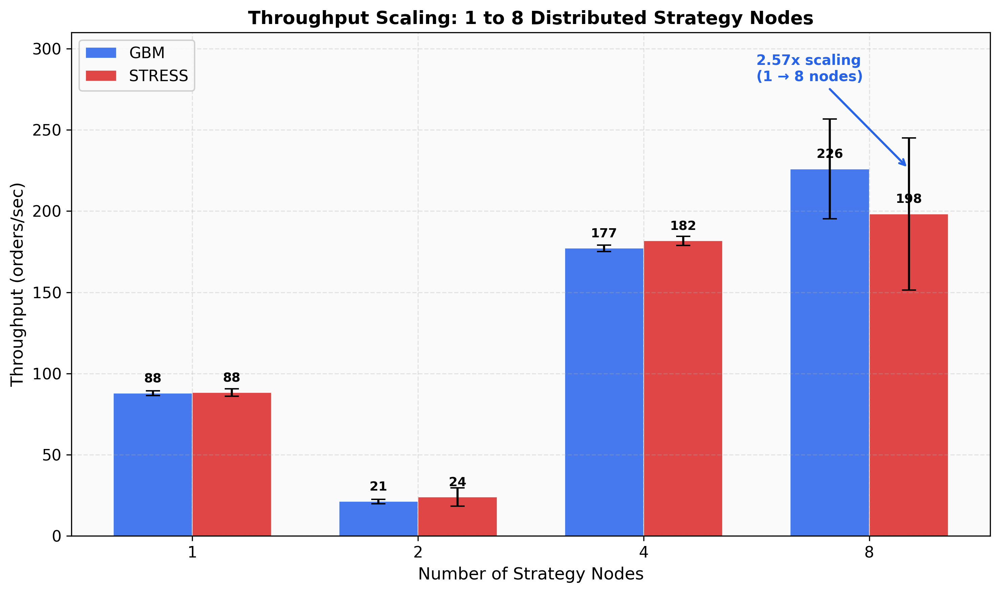
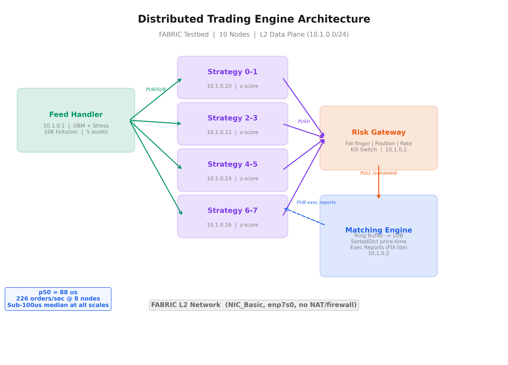

# Distributed Low-Latency Trading Engine

A distributed, low-latency trading engine deployed across 10 nodes on the [NSF FABRIC testbed](https://fabric-testbed.net/). The system implements a complete order lifecycle — market data generation, multi-node strategy execution, pre-trade risk management, and price-time priority order matching — using broker-less ZeroMQ messaging with Protocol Buffer serialization.

Built for **CS 451: Distributed Systems** at Illinois Institute of Technology (Spring 2026).



## Key Results

| Metric | Value |
|--------|-------|
| Median latency (p50) | **88 us** across all configurations |
| Peak throughput | **260 orders/sec** (8 nodes, stress) |
| Scaling | **2.57x** throughput improvement (1 to 8 nodes) |
| p95 latency | **< 190 us** at all scales |
| Benchmark trials | **40** (4 scales x 2 scenarios x 5 trials) |
| FABRIC nodes | **10** (1 feed + 1 engine + 8 strategy) |

## Architecture

```
Feed Handler ──PUB/SUB──> Strategy Nodes (1-8) ──PUSH──> Risk Gateway ──PUSH──> Matching Engine
  (GBM ticks)              (z-score signal)        (4 risk filters)       (LOB, price-time)
  10K ticks/sec            rolling window           fat-finger/pos/rate     SortedDict + deque
  5 assets                 buy z<-2, sell z>2       kill switch             FIX-lite exec reports
```



### Components

| Component | Description | ZMQ Pattern |
|-----------|-------------|-------------|
| **Feed Handler** | GBM random walk or stress-mode tick generation for 5 assets | PUB (port 5555) |
| **Strategy Nodes** | Mean-reversion (z-score) and ML (gradient-boosted) signal strategies | SUB + PUSH |
| **Risk Gateway** | Fat-finger ($100K), position limits, rate limiter, kill switch | PULL + PUSH |
| **Matching Engine** | LMAX-inspired ring buffer to SortedDict LOB with price-time priority | PULL + PUB |
| **Dashboard** | Jupyter ipywidgets — real-time P&L, latency histograms, kill switch | SUB |

### Technology Stack

| Layer | Choice | Why |
|-------|--------|-----|
| Messaging | ZeroMQ (broker-less) | Zero-copy, no broker bottleneck, production HFT pattern |
| Serialization | Protocol Buffers (upb C) | ~10x faster than JSON, schema-enforced |
| Order Book | SortedDict (sortedcontainers) | O(log N) price-level ops, FIFO time priority per level |
| Ingestion | Ring buffer (deque maxlen=65536) | LMAX Disruptor-inspired, zero heap alloc on hot path |
| Network | FABRIC L2 NIC_Basic | Direct Layer-2 Ethernet, no NAT/firewall overhead |
| Strategy | NumPy rolling z-score + scikit-learn GBM | Vectorized signal computation |

## Quick Start

### Local (single machine, multi-process)

```bash
# Install dependencies
pip install -r requirements.txt

# Compile protobuf messages
make proto

# Run full pipeline (Ctrl+C to stop)
make run-local

# 60-second smoke test
make run-local-60

# With ML strategy
make run-local-ml

# Run tests
make test
```

### FABRIC Deployment (10 nodes)

```bash
# Requires FABRIC credentials in ./creds/
# (id_token.json, fabric_cc, slice_cc + public keys)

python3.12 run_fabric.py 2>&1 | tee run_fabric.log
```

This will:
1. Create a 10-node slice at EDUKY (feed + engine + 8 strategy nodes)
2. Set up L2 data-plane network (10.1.0.0/24)
3. Install Python 3.11 + dependencies on all nodes
4. Run connectivity checks (ICMP, TCP, ZMQ)
5. Execute smoke test (1 strategy, 30s)
6. Run 40 benchmark trials (1/2/4/8 nodes x GBM/stress x 5 trials)
7. Run fault injection (kill strat-7 at t=30s)
8. Save results and delete slice

## Project Structure

```
distributed-trading-engine/
|
|-- engine/                      # Core engine modules (~1,900 LOC)
|   |-- config.py                # Topology loader, fabric/local mode switching
|   |-- zmq_factory.py           # Socket factory (enforces LINGER, HWM defaults)
|   |-- feed_handler.py          # Market data PUB — GBM, stress, and replay modes
|   |-- lob.py                   # Limit Order Book — SortedDict + deque per level
|   |-- matching_engine.py       # Ring buffer ingestion, price-time matching, metrics
|   |-- risk_gateway.py          # 4 risk filters + kill switch
|   |-- strategy.py              # BaseStrategy, MeanReversion, MLSignal strategies
|   |-- datasets.py              # Binance/Yahoo data loading + replay
|
|-- proto/                       # Protocol Buffer definitions
|   |-- messages.proto           # MarketDataTick, NewOrderSingle, ExecutionReport, etc.
|   |-- messages_pb2.py          # Compiled protobuf (generated)
|
|-- config/
|   |-- topology.yaml            # ZMQ endpoints, host mapping, engine/risk settings
|
|-- scripts/
|   |-- start_pipeline.py        # Local orchestrator (multi-process)
|   |-- compile_proto.sh         # Protobuf compiler
|   |-- fetch_datasets.py        # Download Binance/Yahoo historical data
|   |-- train_ml_model.py        # Train gradient-boosted ML signal model
|
|-- models/
|   |-- ml_signal_model.joblib   # Pre-trained scikit-learn classifier
|   |-- ml_model_meta.json       # Model metadata (features, accuracy)
|
|-- tests/                       # Unit + integration tests
|   |-- test_lob.py              # LOB correctness (price-time priority, partial fills)
|   |-- test_matching_engine.py  # End-to-end matching engine process tests
|   |-- test_risk_gateway.py     # Risk filter unit tests
|   |-- test_strategy.py         # Strategy signal generation tests
|   |-- test_strategy_integration.py  # Multi-process strategy tests
|   |-- test_feed_handler.py     # Feed handler tick rate tests
|   |-- test_messaging_smoke.py  # ZMQ connectivity smoke tests
|
|-- notebooks/
|   |-- dashboard.ipynb          # Real-time monitoring dashboard (ipywidgets)
|   |-- benchmark_plots.ipynb    # Interactive benchmark visualization
|
|-- report/                      # Benchmark results and figures
|   |-- REPORT.md                # Full written report with analysis
|   |-- benchmark_results.json   # Raw data — 40 trials
|   |-- fault_injection_results.json
|   |-- generate_figures.py      # Regenerate all figures from JSON
|   |-- fig1_throughput_scaling.png/pdf
|   |-- fig2_latency_percentiles.png/pdf
|   |-- fig3_p50_stability.png/pdf
|   |-- fig4_orders_fills.png/pdf
|   |-- fig5_tail_latency.png/pdf
|   |-- fig6_throughput_boxplot.png/pdf
|   |-- fig7_architecture.png/pdf
|   |-- fig8_scaling_efficiency.png/pdf
|   |-- fig9_latency_heatmap.png/pdf
|   |-- fig10_summary_dashboard.png/pdf
|
|-- run_fabric.py                # FABRIC deployment + benchmark orchestrator
|-- Makefile                     # Local dev commands
|-- requirements.txt             # Python dependencies
|-- creds/                       # FABRIC credentials (not committed)
```

## Benchmark Results

### Throughput Scaling (GBM scenario, 5 trials each)

| Nodes | Mean Throughput | Orders/Trial | p50 Latency | p95 Latency |
|-------|----------------|-------------|-------------|-------------|
| 1 | 87.8 orders/sec | 3,864 | 89 us | 174 us |
| 2 | 21.2 orders/sec | 957 | 91 us | 174 us |
| 4 | 177.1 orders/sec | 7,793 | 84 us | 172 us |
| 8 | 225.9 orders/sec | 10,162 | 91 us | 184 us |

*2-node dip is due to self-trade prevention between opposing strategies — see [full report](report/REPORT.md) Section 8.2.*

### All Figures

| # | Figure | Shows |
|---|--------|-------|
| 1 | [Throughput Scaling](report/fig1_throughput_scaling.png) | Bar chart: 1/2/4/8 nodes, GBM vs Stress |
| 2 | [Latency Percentiles](report/fig2_latency_percentiles.png) | p50/p95/p99 grouped bars (log scale) |
| 3 | [p50 Stability](report/fig3_p50_stability.png) | Median stays flat at ~88us across all scales |
| 4 | [Orders & Fills](report/fig4_orders_fills.png) | Order volume and fill counts per config |
| 5 | [Tail Latency](report/fig5_tail_latency.png) | p99/p99.9 growth at 8 nodes |
| 6 | [Throughput Boxplot](report/fig6_throughput_boxplot.png) | Per-trial variance (5 trials per config) |
| 7 | [Architecture](report/fig7_architecture.png) | System component diagram |
| 8 | [Scaling Efficiency](report/fig8_scaling_efficiency.png) | Actual vs ideal linear scaling |
| 9 | [Latency Heatmap](report/fig9_latency_heatmap.png) | All configs x all percentiles |
| 10 | [Summary Dashboard](report/fig10_summary_dashboard.png) | 4-panel overview with key stats |

## Message Flow

```
                    MarketDataTick (protobuf)
Feed Handler ─────────PUB/SUB──────────> Strategy Node
     |                                       |
     | Heartbeat (1 Hz)                      | NewOrderSingle (protobuf)
     |                                       | PUSH/PULL
     v                                       v
Strategy Node                          Risk Gateway
(safe mode if                    (fat-finger | position |
 no heartbeat)                    rate limit | kill switch)
                                             |
                                             | Validated orders
                                             | PUSH/PULL
                                             v
                                      Matching Engine
                                   (Ring Buffer -> LOB)
                                             |
                                             | ExecutionReport (FIX-lite)
                                             | PUB/SUB (topic = strategy_id)
                                             v
                                    Strategy Node + Dashboard
```

## FABRIC Deployment

The system deploys on the [NSF FABRIC testbed](https://fabric-testbed.net/) — a nationwide research infrastructure with programmable networking.

- **Site:** EDUKY (University of Kentucky) — 73,728 cores
- **Nodes:** 10 VMs (2 cores, 4-8 GB RAM each)
- **Network:** L2 NIC_Basic data plane (direct Ethernet, 10.1.0.0/24)
- **Why L2:** Management IPv6 addresses had ZMQ socket issues; L2 gives clean IPv4 with no NAT/firewall

## Course Requirements Met

| Requirement | Status |
|-------------|--------|
| Distributed system on FABRIC | 10 nodes, EDUKY site |
| Scaling story (1 to 8 nodes) | 2.57x throughput improvement, 40 trials |
| 3 I/O examples | ZMQ PUB/SUB (market data), PUSH/PULL (orders), File I/O (metrics) |
| Fault injection | Kill strat-7 at t=30s, verify isolation |
| Jupyter dashboard | ipywidgets real-time monitoring + kill switch |
| 5-page report | [Full report with 10 figures](report/REPORT.md) |

## License

Academic project — IIT CS 451, Spring 2026.
